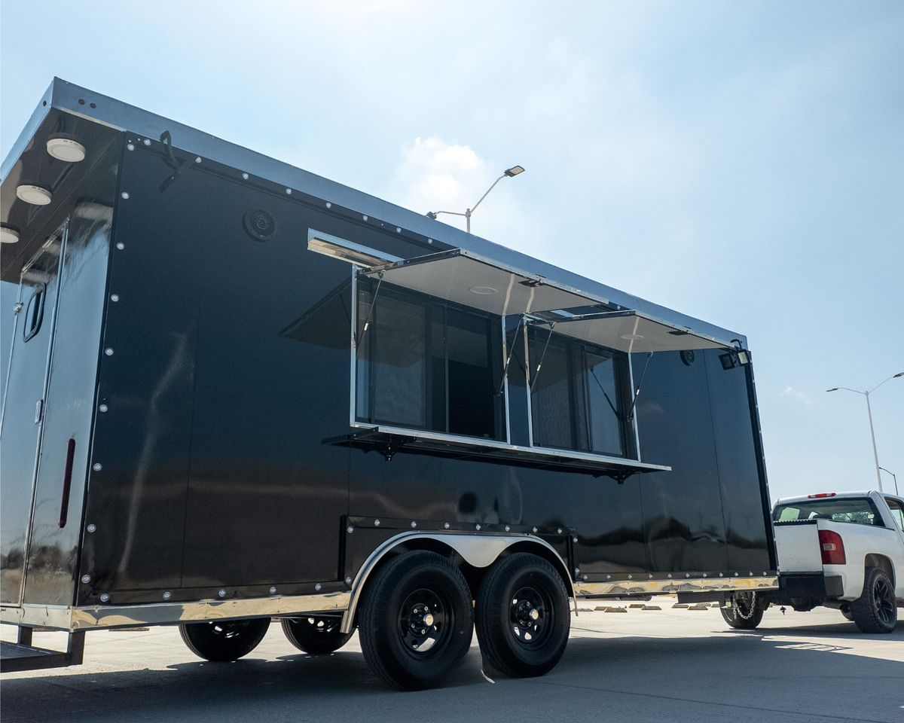

# RSV Trailers — Landing Page
## Guía completa paso a paso

---

## PASO 1 — Instalar herramientas (una sola vez)

### 1.1 Node.js
Descarga e instala desde: https://nodejs.org (versión LTS)
Verifica: `node -v` en tu terminal → debe mostrar v18+

### 1.2 VS Code
Descarga desde: https://code.visualstudio.com

### 1.3 Claude Code
Abre una terminal y ejecuta:
```bash
npm install -g @anthropic-ai/claude-code
```
Luego autentícate:
```bash
claude
```

### 1.4 Vercel CLI (para el deploy)
```bash
npm install -g vercel
```

---

## PASO 2 — Abrir el proyecto

```bash
# Entra a la carpeta del proyecto
cd rsv-trailers

# Abre VS Code aquí
code .
```

---

## PASO 3 — Meter tus fotos

Crea una carpeta `images/` dentro del proyecto y pon tus fotos ahí:

```
rsv-trailers/
├── index.html
└── images/
    ├── trailer-hero.jpg      ← foto principal del hero
    ├── taller.jpg            ← foto del taller para "nosotros"
    ├── galeria-1.jpg
    ├── galeria-2.jpg
    ├── galeria-3.jpg
    ├── galeria-4.jpg
    └── galeria-5.jpg
```

**Formatos recomendados:** JPG o WebP
**Tamaño máximo por foto:** 500 KB (usa https://squoosh.app para comprimir)

---

## PASO 4 — Editar tus textos

Abre `index.html` en VS Code y busca los comentarios `<!--EDITA:-->`:

| Qué editar | Cómo buscarlo |
|---|---|
| Descripción hero | `<!--EDITA: Tu descripción principal aquí-->` |
| Stats (números) | `<!--EDITA: Tus números reales-->` |
| Diferenciadores | `<!--EDITA: Tus 3 diferenciadores-->` |
| Testimonios | `<!--EDITA: Tus 3 testimonios reales-->` |
| Info de contacto | `<!--EDITA: Tu info de contacto real-->` |
| Número WhatsApp | `const TU_WHATSAPP = '528100000000';` |

---

## PASO 5 — Activar tus fotos

En `index.html`, para cada foto encuentra el bloque comentado y actívalo:

**Hero (foto principal):**
```html
<!-- ANTES (quita este placeholder) -->
<div class="hero-img-placeholder">...</div>

<!-- DESPUÉS (activa esta línea) -->

```

**Galería:**
```html
<!-- ANTES -->
<div class="gallery-item">
  <div class="gallery-placeholder">...</div>
</div>

<!-- DESPUÉS -->
<div class="gallery-item">
  
</div>
```

---

## PASO 6 — Usar Claude Code para editar rápido

Abre la terminal integrada de VS Code y ejecuta:
```bash
claude
```

Prompts útiles para pegarle a Claude Code:

```
"Reemplaza todos los placeholders de imágenes con mis fotos reales.
Las fotos están en la carpeta images/ con estos nombres:
- trailer-hero.jpg (hero)
- taller.jpg (nosotros)
- galeria-1.jpg hasta galeria-5.jpg (galería)"

"Actualiza los textos con mi información real:
- Nombre: RSV Trailers
- Descripción: [tu descripción]
- Años de experiencia: X
- Trailers entregados: X
- WhatsApp: +52 81 XXXX XXXX"

"Agrega mi logo. El archivo es images/logo.png y debe aparecer
en el nav y en el footer en lugar del texto RSV Trailers"

"Optimiza todas las secciones para mobile. Revisa que el nav,
hero, galería y formulario se vean bien en pantalla de 375px"

"Cambia el color dorado #C49A3C por este hex: [tu color de marca]"
```

---

## PASO 7 — Ver en tu computadora antes de publicar

Instala un servidor local simple:
```bash
npm install -g serve
serve .
```
Abre: http://localhost:3000

---

## PASO 8 — Publicar en internet (gratis con Vercel)

```bash
# Desde la carpeta rsv-trailers/
vercel

# Primera vez: te pide login con tu cuenta de Vercel (créala gratis en vercel.com)
# Responde:
#   Set up and deploy? → Y
#   Project name? → rsv-trailers
#   In which directory? → ./
#   Override settings? → N
```

En ~30 segundos tendrás una URL pública como:
`https://rsv-trailers.vercel.app`

### Para actualizar después de cambios:
```bash
vercel --prod
```

---

## PASO 9 — Dominio personalizado (opcional, ~$12 USD/año)

1. Compra tu dominio en: namecheap.com o porkbun.com
   - Ej: `rsvtrailers.com`

2. En tu dashboard de Vercel:
   - Settings → Domains → Add Domain
   - Escribe tu dominio y sigue las instrucciones de DNS

---

## PASO 10 — Formulario de contacto funcional

El botón ya envía los datos por WhatsApp. Si quieres también recibir emails, agrega Formspree:

1. Crea cuenta gratis en formspree.io
2. Crea un nuevo form → copia tu endpoint
3. Dile a Claude Code:

```
"Agrega Formspree al formulario de contacto.
Mi endpoint es: https://formspree.io/f/XXXXXXXX
Cuando el usuario envíe el formulario, además de abrir WhatsApp,
debe enviar los datos a Formspree para recibirlos por email."
```

---

## Resumen de costos

| Servicio | Costo |
|---|---|
| Hosting (Vercel) | **Gratis** |
| Dominio (.com) | ~$12 USD/año |
| Formspree (emails) | **Gratis** hasta 50/mes |
| **Total mínimo** | **$0/mes** |

vs Shopify: $29–79 USD/mes ✓

---

## Estructura final del proyecto

```
rsv-trailers/
├── index.html          ← toda la página
├── README.md           ← esta guía
└── images/
    ├── trailer-hero.jpg
    ├── taller.jpg
    ├── galeria-1.jpg
    ├── galeria-2.jpg
    ├── galeria-3.jpg
    ├── galeria-4.jpg
    └── galeria-5.jpg
```

---

**¿Dudas?** Abre Claude Code y pregúntale directamente sobre el código.
Siempre dale contexto: _"Estoy trabajando en el landing de RSV Trailers, el archivo es index.html..."_
